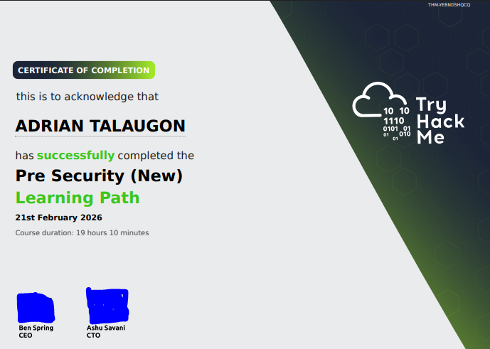

# CyberSecurityWriteUps - Web Exploitation

## About
A compact collection of web exploitation writeups: concise challenge walkthroughs, vulnerability analysis (XSS, SQLi, CSRF, auth flaws), exploitation steps, and remediation notes—useful for learners and practitioners.

## Road Map
- [RoadMap](RoadMap.md)

## Notes
- [WebFundamentals](WebFundamentals.md)
- [SQL Injection](sqlinjection.md)

## CheatCodes
- [Kali Linux & Burp Suite](CheatCodes.md)

## Writeup Challenge
- [Day 1: Web-Client](DaysChallenge/Day1.md)
- [Day 2: Web-Client](DaysChallenge/Day2.md)
- [Day 3: Web-Server](DaysChallenge/Day3.md)
- [Day 4: Web-Server](DaysChallenge/Day4.md)

----
# CTF Challenges: 

## Love at First Breach Challenge
- [1st Challenge: Valefind](LoveAtFirstBridge/1stChallenge.md)
- [2nd Challenge: Hidden Deep Into my Heart
](LoveAtFirstBridge/2ndChallenge/DeepintomyHeart.md)

----
## Tools
- Burp Suite Community Edition
- Guide: https://portswigger.net/burp/documentation/desktop/getting-started/intercepting-http-traffic
- Kali Linux Virtual Box: https://www.kali.org/get-kali/#kali-virtual-machines

## TryHackMe Paths

- https://tryhackme.com/room/defensivesecurityintro
- https://tryhackme.com/room/offensivesecurityintro
- https://tryhackme.com/path/outline/web
- https://tryhackme.com/room/sqlinjectionlm
- https://tryhackme.com/room/theciatriad
- https://tryhackme.com/room/dnsindetail
- https://tryhackme.com/room/databasesqlbasics
- https://tryhackme.com/room/becomeahacker

## Certificates
